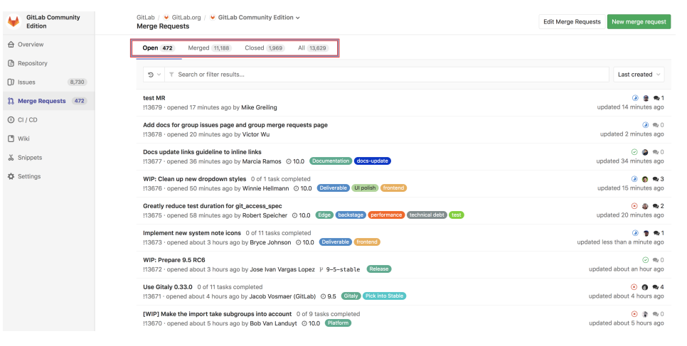
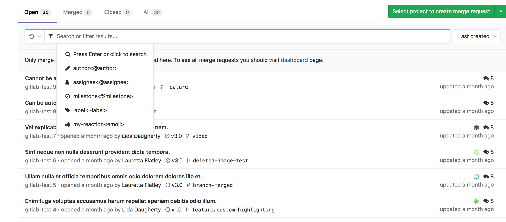
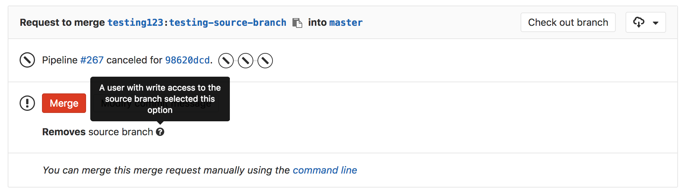
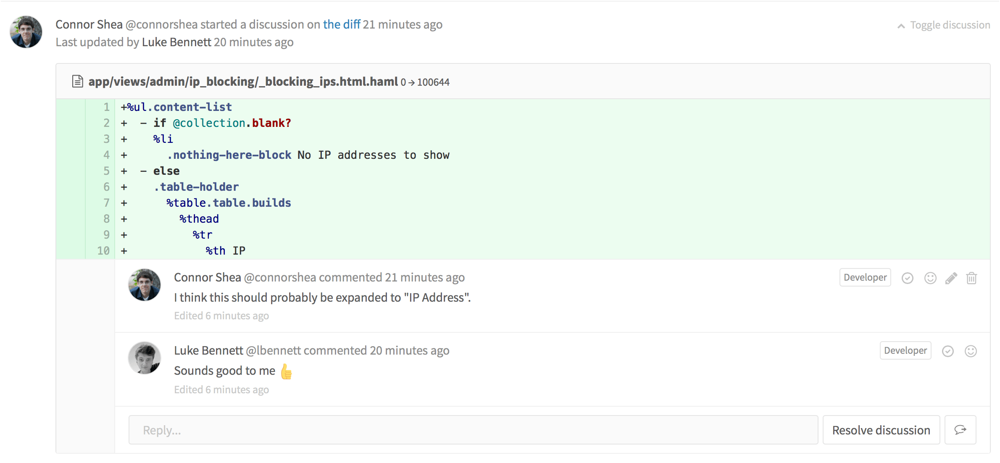
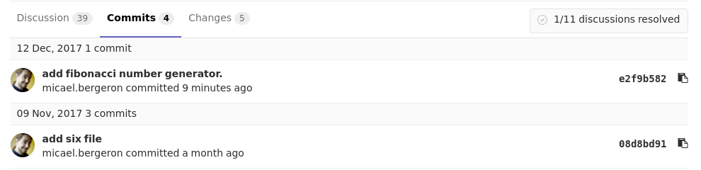
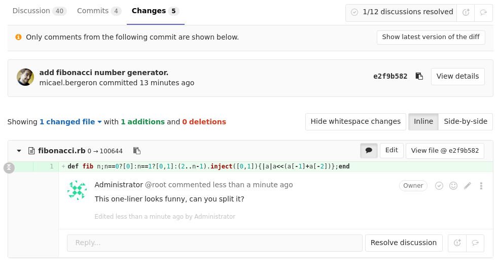
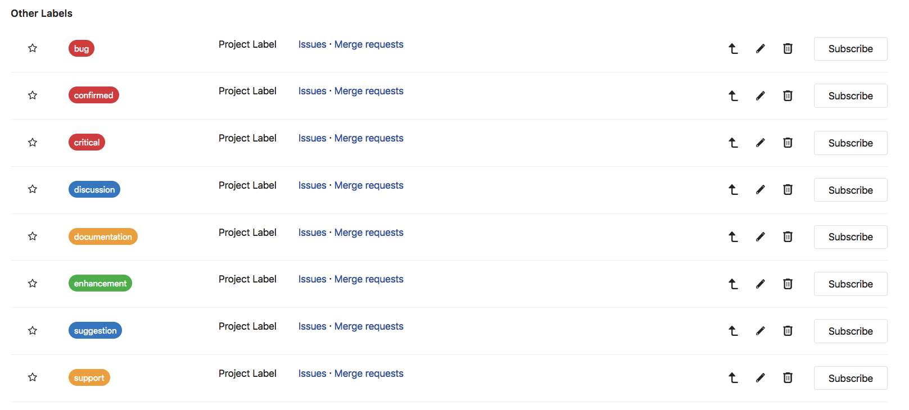
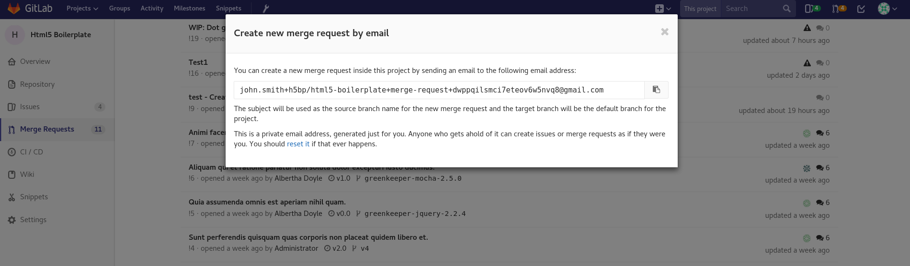

# Intro

## Intro 

* Allow to exchange changes made to source code
* Collaborate with other people on the same project
* *Request* to *merge* one brach into another

# Benefits of using GitLab Merge requests

## Benefits of using GitLab Merge requests

* Comparison between changes in two branches
* Reviews and discussions – proposed modifications inline
* Live preview of the changes when *Review Apps* configured for the project
* Builds, tests and deployment in a per-branch basis with built-in GitLab CI/CD
* Prevent the MR from being merged before it’s ready with *Work In Progress MRs* 

## Benefits of using GitLab Merge requests

* Visible deployment process through *Pipeline Graphs*
* Automatically closure of issues that originated the implementation proposed in the MR
* Convenience by reassigning the assignee
* Convenience by assigning a milestone and keeping track of the development 
* Easier organization of issues and MRs with labels

## Benefits of using GitLab Merge requests

* Time Estimation & Time Spent with *Time Tracking*
* Resolve merge conflicts from the UI
* Possible *Fast-Forward MRs*
* *Semi-Linear history MRs* – another security layer for pipeline passing

## Benefits of using GitLab Merge requests

* Creation of new MRs by email
* Possible edit of the MR from maintainers

# Merge requests per project

## Merge requests per project

* *Project > Merge Requests*
* Open/Merged/Closed Requests

# Merge requests per group

## Merge requests per group

* *Group > Merge Requests*

# Removing the source branch

## Removing the source branch

* *"Remove source branch when merge request accepted"* option on creation of a MR
* Also visible in an existing one
* Visible only to master users

# Discussions

## Discussions

* Comments at issues, MRs, snippets, commits, commit diffs
* Resolvable discussions

## Discussions

* Commit discussions in the context of a MR

## Discussions

* Jumping between unresolved discussions
* Marking a comment or discussion as resolved
* Move all unresolved discussions in a merge request to an issue
* Moving a single discussion to a new issue

## Discussions

* Only allow merge requests to be merged if all discussions are resolved
* Automatically resolve merge request diff discussions when they become outdated
* Threaded discussions
* Image discussions
* Lock discussions

# Automatically close an issue

## Automatically close an issue

* Via Merge Request

* From the Issue Board

# Labels

## Labels

* Allow categorization of issues and MRs using discriptive titles
* Project and group labels
* *Issues > Labels*

# Fast-Forward Merge requests

## Fast-Forward Merge requests

* Linear Git history
* No merge commits
* *Settings → ‘Merge method’ → Fast-forward merge*

# Semi-Linear history merge requests

## Semi-Linear history merge requests

* Merge commit for every merge
* Merged only if FF possible
* Ensures success by pipeline passing
* *Merge Requests: Merge method → Merge commit with semi-linear history* 

# Creation of new merge requests by email

## Creation of new merge requests by email

* By clicking on *“Email a new merge request to this project”* button
* The subject – the source branch name
* The message body – the MR description 

