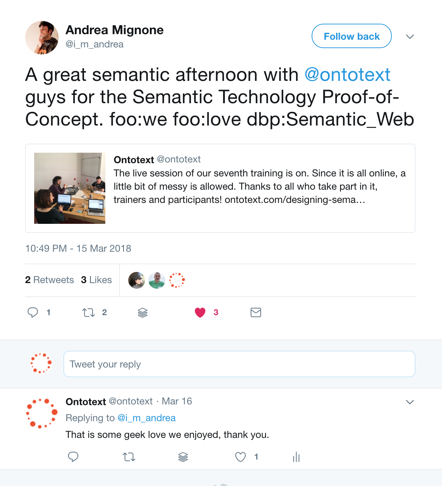

# Types and Number of Trainings

## Re-occurring Trainings
* Designing Semantic Technologies PoC 
    * pre-training - 1 week engagement
    * online training - 5h
* GraphDB for DevOps 
    * pre-training - 1 week engagement
    * online training - 3 days x 6h
* Semantic Data Integration (Tentative) 

## Custom Trainings
* Semantic Technologies & GATE _@JP Morgan&Chase_
* LD Sources, Robust Text Analysis and Semantic Search _@SEMANTICS'2017_
* Semantic Technologies _@ArcelorMittal_ - online
* Gold Standard Corpora _@Platts_ - online
* GATE NLP Platform _@IET_ - online

## Collaboration with Universities
* FMI, University of Sofia (Prof. Maria Nisheva and Prof. Ivan Koychev)
    * materials for courses: "Knowledge modelling and representation" and "Knowledge bases", taught for MSc in AI
    * lecturing in AI course taught for BSc in Computer Science
* University of Aberdeen (Ass. Prof. Adam Wyner, currently at Swansea University)
    * materials for the course "Knowledge Representation and Reasoning", taught for MSc in Computing Science 
* ESSLLI 2018
    * hands-on with GraphDB and technical support for the course "Introduction to Linked Open Data in Linguistics", Thierry Declerck and John P. McCrae

## Trainings' Calendar

{width=1200px}

# PoC Training in Details
## Agenda

* 3h video tutorials on Semantic Technologies (pre-training)
* Hands-on with SPARQL (pre-training)
* Designing a PoC with GraphDB (live session)
    * Discussing the principles of design
    * ETL process
    * Basic data modelling
    * Querying the data - demonstrating the power of LOD through federation
    * Demonstrating helpful GraphDB features - autocomplete, namespaces, visual graph, exploration of resources and class hierarchy
    * Demonstrating OT demos - Rank, NOW 
* Individual sessions - 1h devoted time to a given participant

## PoC Training Progress and Outcomes
* 7 editions of the training
* Improvement of the materials over time according to the user feedback
    * from a demonstration with OntoRefine and a couple of SPARQL queries in Dec 2016
    * to a smooth workflow including a real design of a PoC passing through all the steps of the design in Mar 2018
* Raising number of involved trainers - people who can jump in and lecture part of it
    * 1 tutor in Dec 2016
    * 5 tutors in Mar 2018
* Training of OT newcomers - 3
* Training of potential clients or partners 
* Reuse of materials for other training and webinars

# GraphDB for DevOps Training in Details
## Agenda
* 3h video tutorials on Semantic Technologies (pre-training)
* Hands-on with SPARQL (pre-training)
    * Product editions and features
    * GraphDB Quick Start
    * Product APIs 
    * SPARQL 
    * Reasoning 
    * Connectors
    * Administration & Monitoring 

## GraphDB for DevOps Training Progress and Outcomes
* 1 internal edition of the training
* 1 public edition of the training
* Improvement of the materials over time according to the user feedback - the internal training contributed much about it
* Raising number of involved trainers - people who can jump in and lecture part of it
    * 5 in January 2018
    * 7 in May 2018
* Training of OT developers - 12
* Training of potential clients or partners 
* Reuse of materials for other training and webinars

# Clients and Revenue

## Participants

* Designing SemTech PoC: a total of 153 participants spread over 7 editions of the training

{width=800px}

* GraphDB for DevOps: two participants so far

## Companies by Country
* Designing SemTech PoC

{width=800px}

* GraphDB for DevOps: Canada, Holland

## Companies by Country - Designing SemTech PoC

 country        | count | country         | count |country          | count 
----------------|-------|-----------------|-------|-----------------|-------
 USA            |36| Greece         |2| Lithuania       |1
 United Kingdom |18| Luxembourg     |2| New Zealand     |1
 Germany        |12| Netherlands    |2| Portugal        |1
 France         |8| Saudi Arabia   |2| Romania         |1
 India          |8| The Netherlands |2|Singapore       |1
 Canada         |7| Denmark         |1|Sweden          |1
 Spain          |6| Ecuador         |1|Ukraine         |1
 Bulgaria       |5| Egypt           |1|                |       
 Italy          |5| Finland         |1|                |       
 Switzerland    |4| Hong Kong       |1|                |       
 Australia      |2| Ireland         |1|                |       
 Belgium        |2| Israel          |1|                |       

## Companies by Country - GraphDB for DevOps
company         |country           |industry
----------------|------------------|------------
Kadaster        |The Netherlands   |Government
Semantic World  |Canada            |Technology

## Participants by Job Titles
{width=1000px}

## Participants by Use Case I

* Web-based catalogue for technologies
* Knowledge-based web service to provide information on heating and cooling technologies
* The project focuses on the biological annotation of cancer evolutionary dynamics, and will harness semantic annotation for 
    * minimizing concept ambiguity, 
    * linking our data to an external and evolving KB, like Wikidata, and 
    * making smarter and federated queries on a structured KB.
* Using healthcare records stored in an RDF triple store
* Analysing text documents, building ontologies to support natural language QA
* Automatically crawling and structuring data on performing arts websites in Canada to enable complex queries and export JSON-LD event entities for search engines.

## Participants by Use Case II
* Using of ontologies and inference for business processes/workflows
* A project similar to now.ontotext.com
* LOD projects
* Having a big set of linked data consisting of airborne and Open Street data of United Kingdom, I want to find the schools and the hospitals which are in a region with polluted air. Children and patients are the most vulnerable group of people and they should take care of the environment where they live in.
* Predictive maintenance of aircraft fleet based on a range of data sources

## Revenue
* Positive financial result for 2017 for online trainings
* Since materials from the online trainings are reused for client custom trainings, we do have good profit from the client trainings
* The financial result as of April 2018 is still negative however the incomes from May are not calculated yet and the balance should be good at the end

# Advertisment

## Channels for Attracting Users I
* Email - the main conversion point (which results in training registrations)
* Social Media (Twitter, LinkedIn, Facebook)

{width=600px}

## Channels for Attracting Users II
* Ads (Google, KD Nuggets, DB Engines)

{width=800px}

# Follow-up
## Conversions to Opportunities
Currently, there are no formal open opportunities (closed won or closed lost) with participants from the training but we are in touch with several of them in relation to their ongoing projects, in which they implement GraphDB and/or some other relevant technology.

## Use Case 1: Gregory Saumier-Finch, [Culture Creates](http://www.culturecreates.com/)

* Culture Creates is a Canadian company that makes live events findable for voice powered search and AI powered virtual assistants, like Siri, Alexa and Google Assistant. It also wants to ensure that arts organizations will always be the digital authority of their own metadata.

* A PoC was presented earlier this year at a conference in Quebec City in Canada, focusing on Innovation in Culture. Part of the presentation was dedicated to showing how GraphDB works when filled with current performing arts events metadata. A couple of visualizations
based on SPARQL queries were also generated.

* Video (2:49): https://www.youtube.com/watch?v=WalOgD41kDE

## Use Case 2: Adam Wyner, University of Aberdeen

* Already presented 

# Trainees' Feedback

## Andrea Mignone
{width=600px}

# Who is Involved

## The Team

* Trainings are multi-disciplinary projects
* They unite efforts by several Ontotext teams

ICO						|SAS					|DMP						|Marketing
------------------------|-----------------------|-----------------------|----------------------
Vladimir Alexiev 		|Neli Hateva			|Radostin Nanov			|Iva Mechkunova
Ivelina Nikolova		|Petar Mitankin			|Teodor Todorov			|Milen Yankulov
Alexander Popov			|						|						|
Boyan Simeonov			|						|						|
Andrey Tagarev			|						|						|
Plamen Tarkalanov		|						|						|
Nikola Tulechki			|						|						|

## With the Special Participation of
* Vassil Momtchev
* Atanas Kiryakov

## The New Training Master

. . . 

Nikola Tulechki
