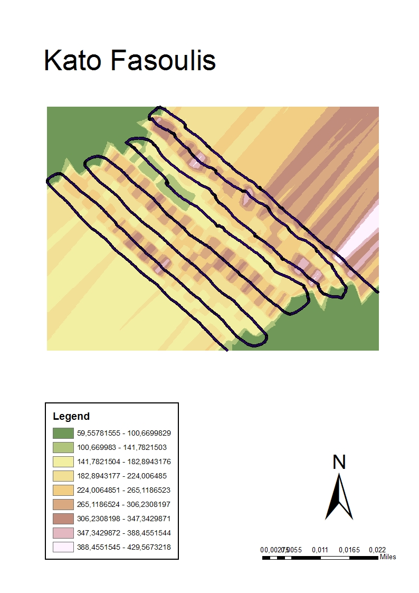
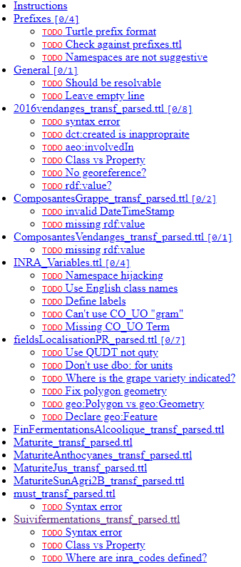
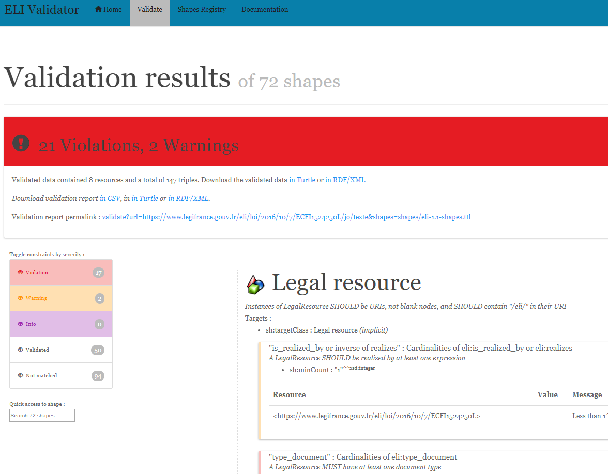

# Achievements

## Scope and Meetings

- WP3 Data & Semantics Layer is a core WP of the project
  - If we have no data, we can have no achievements
- Between 30 Apr and 16 July, ONTO hosted 6 project meetings
- Currently working on T3.1 Data Modelling over Big Data Infrastructures (**ONTO, AGRO, AUA, INRA**)
- After we figure out a semantic data model, we should start on T3.2 Data Ingestion and Integration
- In parallel (and very soon!), we should start on T3.3 Big Data Indexing (also **CNR**)
- Participants (most active listed first):
  - ONTO: Vladimir
  - AGRO: Antonis, Pythagoras
  - AUA: Katerini
  - INRA: Sabine-Karen, Danai?
  - Occasional: CNR, Geocledian, Apigea

## Semantic Data Integration Steps
- data analysis
- defining data requirements (competence questions)
- ontology engineering: selection, combination and extension of ontologies
- *(we are somewhere here)*
- semantic modeling and creating application profiles and/or RDF shapes (SHACL, ShEx)
- semantic conversion and tools, depending on source (CSV/TSV tabular, RDBMS, XML)
- semantic alignment and instance matching
- URL design, semantic publishing, content negotiation
- data validation and data quality management/measurement
- data update flows
- model documentation, sample queries, deploying queries as services


## Minutes and Resources
- gfolder [WP3](https://drive.google.com/drive/folders/1-_h8mXQLt2lglzEyNk09C5csQf9fCSk2)
- gdoc [WP3-meeting-minutes](https://docs.google.com/document/d/1f5wJljke0J7ztM3YioyRhKPLbAKwKoq4ipDBaS6Z28I/edit) has: minutes, background from DOW, links to resources, detailed material
- When some material gets bigger, we split it off to a separate file
- Github repo: [https://github.com/BigDataGrapes-EU/ontology](https://github.com/BigDataGrapes-EU/ontology) (first WP in the project)
  - data: semantic data (for now, some samples)
  - ttl: relevant ontologies converted to turtle (and added prefixes) for easier reading
  - misc: ontology materials in miscellaneous formats (eg xlsx, obo)
  - notes: various notes on ontologies and data.
- Mirroring between gfolder and Github, bad idea, **must decide** [Github or Google Drive](https://docs.google.com/document/d/1TfWhafz2S_Py9rshf8bmaSyNyalelqEDXU7RpxJ4zEw/edit#heading=h.o4ozc4xsspj5) 

## Ontologies Researched
- AGRO submitted sheet [Relevant Ontologies and Vocabularies](https://docs.google.com/spreadsheets/d/1Wa9JJ96mh3oANKyoEWAoEtXxJ-ERxH08-GEee322wjg/edit): 16 relevant ontologies, plus 21 on specific crops to use as examples
- ONTO downloaded 17 ontologies, converted to ttl which is easier to read
- ONTO researched them to some extent and wrote up various problems (see next)
- ONTO also researched several ontology portals, with a total of 200 ontologies, 5M classes (!), 16k props, 476k individuals

## Ontology List
:::::::::::::: {.columns}
::: {.column}
- AEO (OAE): Agricultural Experiments Ontology
- AFEO: Agri-Food Experiment Ontology
- AGRO: Agronomy Ontology
- AT: Agricultural Technology Ontology
- BCO: Biological Collection Ontology
- BFO: Basic Formal Ontology
- ChEBI: Chemical Entities of Biological Interest
- CO: Crop Ontology (series of)
  - CO_320: Rice
  - CO_322: Maize
  - CO_356: Vitis (viticulture)
  - CO_357: Woody Plant
  - CO_UO: Units Ontology
:::
::: {.column}
- EO (ENVO): Environment Ontology
- IAO: Information Artifact Ontology
- MMO: Measurement Methods Ontology
- NCBITaxon: NCBI Taxonomy
- OBO: Open Biological and Biomedical Ontology (a big set)
- OEPO: Ontology for Experimental Phenotypic Objects
- OFPE: Ontology for Food Processing Experiment
- PATO: Phenotypic Quality Ontology
- PCO: Population and Community Ontology
- PECO: Plant and Environemental Conditions Ontology
- PO: Plant Ontology
- RO: Relations Ontology
- SDGIO: SDG-Interface Ontology
- TO: Trait Ontology
- UO: Unit Ontology
:::
::::::::::::::

## Ontology Metrics

|           | Classes | Properties | Individuals |
|-----------|---------|------------|-------------|
| AEO       | 56      | 36         | 30          |
| AFEO      | 68      | 8          | 0           |
| AGRO      | 1685    | 709        | 284         |
| BCO       | 157     | 279        | 28          |
| BFO       | 35      | 20         |             |
| CHEBI     | 128900  | 45         |             |
| CO_356    | 814     | 10         |             |
| ENVO      | 8510    | 241        | 21          |
| FOODON    | 27050   | 130        | 359         |
| IAO       | 219     | 111        | 23          |
| NCBITaxon | 1692930 | 27         |             |
| ...       | ...     | ...        | ...         |
| **TOTAL** | 1874943 | 3598       | 1467        |

## Ontology Portals

Useful to search for terms, see total size, inspiration for our own tools

- [OBOfoundry](http://www.obofoundry.org/): list of ontologies, with resource links
- [CropOntology](http://www.cropontology.org/): collaborative ontology development
  - [CO Annotation](http://www.cropontology.org/annotation-tool): **annotate tabular data with terms**
- [Planteome](http://browser.planteome.org/amigo): PO, TO, EO. [Tree browser](http://browser.planteome.org/amigo/dd_browse), [graph vis](http://browser.planteome.org/visualize?mode=client_amigo)
- [EBI OLS](http://www.ebi.ac.uk/ols/): 200 ontologies eg [agro](http://www.ebi.ac.uk/ols/ontologies/agro), Crop Ontologies, Tree browser, graph vis, useful search eg [NDVI](https://www.ebi.ac.uk/ols/search?q=Canopy+green+normalized+difference+vegetation+index)
  - [EBI OXO](https://www.ebi.ac.uk/spot/oxo/): **Ontology Xref Service**: serves ontology mappings, will integrate to OLS in 2018
- GODAN VEST: AgriSemantics Map of Data Standards: 398 ontologies, 215 Food and agriculture, 76 from AgroPortal, 328 from VEST Registry. Eg [AEO](http://vest.agrisemantics.org/content/agricultural-experiments-ontology)
- [OntoBee](http://www.ontobee.org): eg [PO](http://www.ontobee.org/ontology/po), [AGRO](http://www.ontobee.org/ontology/agro). Detailed Statis, eg [PO](http://www.ontobee.org/ontostat/PO)
- [ABER OWL](http://aber-owl.net): eg [AGRO](http://aber-owl.net/ontology/AGRO). Simpler browsing

## AUA Tabular Data

[Table Grapes Data](https://drive.google.com/open?id=1_id0r5pEH-VgQXZnXBN9C5-7SJn-q0J3uM3JHUzl8LU)

- Look at data in [WP8/Table Grapes Pilot- AUA/Data](https://drive.google.com/drive/folders/16p63tgyPaR7BRiOY-_D1T983y2yfr4X4)
- Look in D8.1 Piloting Plan (specifically [BigDataGrapes_Piloting Plan-AUA](https://docs.google.com/document/d/19-6qKtuDx7EoZBNbjmDBqFdToq1mCvEyLtA5xKinO7I/edit)) for descriptions of equipment and measured indicators
- Tabular observation data: soil, plant canopies, spectral vegetation indexes
- 3 estates: Fasoulis, Kontogiannis, Palivou (see Photos for some images)
- Equipment: EM38, RapidScan, SpectroSense, Crop Circle
- Geo-referenced: longitude, latitude, altitude; timestamped
- About 10 measurements per measurement spot

Represents **realistic measurement data**
- Currently working out a semantic representation to use as etalon for other data

## Data Handling Needs

::::: {.columns}
::: {.column width=60%}
- To tie measurements to a specific plot: localization of geo-coordinates within the plot (GeoSPARQL predicate `within`)
- Discretization (then Averaging) to correlate measurements from different equipment and different days:
  - Of Geo-coordinates (eg to a grid of 2x2m), then 
  - Of Datetime (eg is it ok to correlate two measurements done within a day? How about within a week?)
- Data cleaning: discard defective or outlier measurements
  - Eg1: RapidScan needs some "warm up" time to establish a GPS connection. Discard:
    - Readings with "FIXTYPE: Fix not valid" (missing)
    - Readings with negative ELEVATION (invalid)
  - Eg2: EM38 is affected by metal pillars, so conductivity readings above 100 should be discarded.
    - Eg on [Fasoulis_Kato_EM38_map](https://drive.google.com/open?id=1TbNsEo61sly5EkPf3VcPcxiIIS2n642w), only the green readings should be retained.
- Matches [Use case A. Data Anomaly Detection & Classification](https://docs.google.com/spreadsheets/d/1vP7wZADy1gwE01mxLSBGx-DNAi3h2YCx1xD-bK89Ozk/edit#gid=1369652704).
  - Eg Eca sensing: Georeferenced soil electrical conductivity data; Operations: Data filtering for outliers
:::
::: {.column width=40%} 
{width=70%}
:::
::::::

## INRA RDF Data
- INRA submitted two batches, ONTO provided detailed feedback and error reports
- `data3, data4`: simple observations. INRA data is top 4 nodes, rest is from Vitis


## INRA RDF Data 3, 4 Feedback
Feedback [ontology/notes#INRA Samples](https://rawgit.com/BigDataGrapes-EU/ontology/master/notes/README.html#orgcc3cf98)

- Wrong URL <http://www.cropontology.org/ontology/CO_356/Vitis#1000215>, should be <http://www.cropontology.org/rdf/CO_356:1000215>
- `"2016-09-09T00:00:00.0000000Z"^^xsd:date` pads with fake time 0, uses invalid datatype (should be `xsd:dateTimeStamp`)
- Observations eg <http://vinnotec.supagro.inra.fr/public/Pr/data/observation1> are missing `rdf:type`
- Observation objects eg <http://vinnotec.supagro.inra.fr/public/Pr/2016_SUNAGRI_L1_2_C01_Grappe> are not defined in these files

## INRA RDF Data 5
::::: {.columns}
::: {.column width=60%}
[data/INRA/data5](https://github.com/BigDataGrapes-EU/ontology/tree/master/data/INRA/data5).

- Plot geometry using GeoSPARQL (`geo:asWKT`)
- Observations on harvest, fermentation, maturity, must, total sugars (BRIX refractometry)
- `INRA_Variables.ttl` defines extra terms (maybe they belong in Vitis?)

Fedback `README.org` and [HTML rendered](https://rawgit.com/BigDataGrapes-EU/ontology/master/data/INRA/data5/README.html)

- Detailed feedback provided on 7 files, still need to check 5 files
- About 30 TODO reported, must turn all of them into DONE
:::
::: {.column width=40%} 

:::
::::::

## Data Handling and Validation
[data-validation-handling](https://drive.google.com/open?id=1TfWhafz2S_Py9rshf8bmaSyNyalelqEDXU7RpxJ4zEw). Started rules on:

- How to submit files (**must decide Github or gdrive**)
- How to use and update `prefixes.ttl`
- How to validate syntax using `riot` (and maybe `eyeball`)
- Once we decide on patterns for representing data, we will implement [RDF Shapes](https://www.w3.org/2014/data-shapes/) for validating data requirements

Hope this will grow to a comprehensive doc on semantic data handling and validation by BDG project partners

## Competence Questions

Competence Questions
- What data you **have**
- What data **needs** you have, or what questions the data should be able to answer

Given the abundance of available data and the sea of agro-bio ontologies, **data needs** are crucial to keep the modeling effort focused, and drive these tasks: 

- Seeking more data for specific questions
- Deciding which ontologies to involve and whether more ontological work is needed
- Structuring the data in an appropriate form (semantic modeling)
- Defining data tasks: conversion, cleanup/filtering, discretization…
- Creating sample queries to help data consumers

We need **real, validated** competence questions to drive our work

## AGRO Competence Questions
Submitted draft [Competence Questions](https://drive.google.com/open?id=1LuJ8jKI3EDqi2H9K2QaUSbdPwCOWzwCIYqD4jBAMfqU):

1. Can I retrieve the sub-plots for a given plot?
2. Which varieties are cultivated in a given plot?
3. Can I retrieve weather data for a given plot?
4. Which varieties are cultivated in a soil with certain characteristics?
5. Can I retrieve the origin locale for a given test sample?
6. Can I retrieve images of a plot from which a sample was taken
7. Can I retrieve historical yield results for a plot (providing a timestamp)?
8. Can I retrieve historical weather data for a plot (providing a timestamp)?

Next steps

- ONTO started elaborating
- AGRO needs to add more details, down detalis such as
  - Are geolocation qualifiers (satellite, quality, HDOP) needed?
- All partners must validate questions and ground them in (derive them from) Use Cases

## Data Domains

What data we need to represent?

- Observations: when (timestamp), where (georeference), what (measure, dimension, attribute, and observation)
- Estates and plots, including geospatial data
- Measurement equipment
- Experiments?
- Static nomenclature data, eg: varieties, types of measurement...
- Photos... of what?
- What else??

# Ontology Notes

## Ontology Problems
Github [ontology/notes](https://github.com/BigDataGrapes-EU/ontology/tree/master/notes), [rendered HTML](https://rawgit.com/BigDataGrapes-EU/ontology/master/notes/README.html)

- Numerous prefix problems. Collected master file [prefixes.ttl](https://github.com/BigDataGrapes-EU/ontology/blob/master/notes/img/prefixes.ttl), let's use it
- Ontology namespace and ontology file differ significantly, no semantic resolution
- Some ontologies use wrong namespace (URLs don't mesh), eg Vitis uses `rdfs:subProperty` (it's `rdfs:subPropertyOf`)
- [CO_357/nt](http://www.cropontology.org/ontology/CO_357/Woody%20Plant%20Ontology/nt) is invalid, because someone was too lazy to put in new lines
- Various terms with unfilled labels, eg `CO_356:0000309` "name: No method name found" 
- Viis Mismatch: is `CO_356:1000215` measured in *grams* (name "SBER_W_g") or *milligrams* (relation to `CO_356:4000018` "mg")
- Classes, properties and even some ontology files use numeric codes not English names
  - Makes it necessary to implement some search/browse interface to use them efectively
- Even `rdfs:label` often uses unreadable abbreviations
  - Eg `CO_322:0001093` "EWid_M_mm" means *Ear width, measurement, in mm*
  - Eg `CO_320:0000824` "PanLng_MatAv_UPOV1to3" means *rice panicle length, mature - average, UPOV scale, 1..3*
- Slash in local names make invalid prefixed names, eg `CO_322:0000320/2` is value 3="21-30% dead leaf area" of `CO_322:0000320` "0-10 Senescence scale"
- Space in URL is bad practice, eg `rice:Biotic%20stress`: 
- Many terms declared both `skos:Concept, owl:NamedIndividual, owl:Class` and connected by both `rdfs:subClassOf` and `skos:broaderTransitive`. 
  - represents heavy [punning](https://www.w3.org/2007/OWL/wiki/Punning) and makes OWL inference impossible

## Over-Commitment

In many cases terms are defined at the wrong level of abstraction

- Eg NDVI is defined only in Maize, so it can't be used for grapes (Vitis)
  - Do we repeat the same mistake in Vitis, or try to move this to the Crop Ontology?

- Eg `CO_UO` defines "grams" relative to some woody plant feature.
  This is crazy because a gram is a gram, no matter what it's used to measure.
  So this unit cannot be used for grapes.

```ttl
  CO_UO:0000021 rdfs:label "g"@en; CO:scale_of CO_357:2000105.
  CO_357:2000105 rdfs:label "Ratio shoot root protocol"@en 
```

- It's better to use a proper Units ontology like QUDT, which defines units in terms of fundamentals (Mass, Length, Time, etc) and conversion factors between units

- Namespace hijacking: redefining imported (external) terms

## Ontology Problems: Conclusion

- Property naming convention (lowerCamelCase) not followed, eg `po:Tomato rdfs:subPropertyOf  oboInOwl:SubsetProperty`
- Improperly formatted timestamps, eg `"Jul 28, 2013 6:56:15 AM"^^xsd:dateTime`
- Wrong URL <https://www.w3.org/TR/xmlschema-2/#rf-maxInclusive> (in some text), should be <http://www.w3.org/2001/XMLSchema#maxInclusive> (semantic)
- Mixup of properties and URLs into a string, eg

  ```ttl
  oepo:WindSensor rdfs:isDefinedBy "skos:exactMatch http://purl.oclc.org/NET/ssnx/meteo/aws#WindSensor" ;
  ```

**General conclusions**

- Seems to me there's very little quality control in AgroBio ontologies
- Maybe a lot of these 200 ontologies and 5M terms are created just to do research, not used in real data
- Engage with the AgroBio community to fix some of the problems

# WP3 Problems and Steps

## Not Enough Traction
As you can see on slide "Semantic Data Integration Steps", we're still in the beginning. Reasons:

- No effective leadership by AGRO to collect competence questions and liaise with the AgroBio community
- Irregular meeting attendance: only one meeting was attended by all 4 organizations
- Little progress between meetings
- Feedback (error reports) provided by ONTO received no reaction
- No collaboration in Github yet (hopefully soon)

## Immediate Next Steps

- AGRO: take the lead on validated Competence Questions
- ONTO & AGRO & INRA: establish Ontology Working Group: fixed responsibilities, regular meetings, progress between meetings
- AGRO & INRA: establish collaboration process with the AgroBio community (see [20180623 Modeling Quality](https://docs.google.com/document/d/1f5wJljke0J7ztM3YioyRhKPLbAKwKoq4ipDBaS6Z28I/edit#heading=h.jjrmfqvg444l)): have direct contacts to the persons behind these ontologies (and/or the relevant curation teams)
- INRA & ONTO: map AUA tabular data to ontologies

## Short-Term Plans

DONE

- Research ontologies sent by partners and other related ontologies (AGRO, INRA)

IN-PROGRESS

- Get competence questions (AGRO, all partners)
- Get sample tabular data from partners (AUA, others)
- Get sample RDF data from partners (INRA)
- Report ontology and instance data errors to partners

TODO

- Report ontology errors to AgroBio community and engage to fix them
- Discuss how to represent various Data Domains with partners
- Create a semantic model with [rdfpuml](http://vladimiralexiev.github.io/pres/20161128-rdfpuml-rdf2rml/)
- Create text narrative (see [euBusinessGraph Semantic Model](https://docs.google.com/document/d/1dhMOTlIOC6dOK_jksJRX0CB-GIRoiYY6fWtCnZArUhU/edit?usp=drive_web&ouid=104921038219224672281) as an example)
- Get the model approved

# Long-Term Plans

## Long-Term Plans
- Create [RDF shapes](https://www.w3.org/2014/data-shapes/) for the approved model (SHACL and/or ShEx), establish validation
- Research and specify possible tools (conversion, annotation, search)
- Select or implement/deploy tools
- Implement special data processing (eg cleaning, discretization)
- Establish data ingestion pipeline
- Load data to GraphDB
- Implement sample queries

## Possible Tool: GDB OntoRefine
[OntoRefine](http://graphdb.ontotext.com/standard/loading-data-using-ontorefine.html): part of GDB Workbench, easy cleaning and conversion of tabular data.


## Possible Tool: CO Term Annotation
Eg [CO Annotation](http://www.cropontology.org/annotation-tool): annotate tabular data with terms


Shows that many terms are not found, and ambiguity of terms between ontologies (over-specification)

## Possible Tool: ELI SHACL Validator
[European Legislation Identifier Validator](http://labs.sparna.fr/eli-validator/validate)



## Possible Extensions/Integrations
- Create library of shapes (SHACL or ShEx) for validation, with visualization
- Add library of data shapes (SPARQL CONSTRUCT) to OntoRefine
- Integrate shape validation to OntoRefine

Etc etc etc. But we first need specifications!
