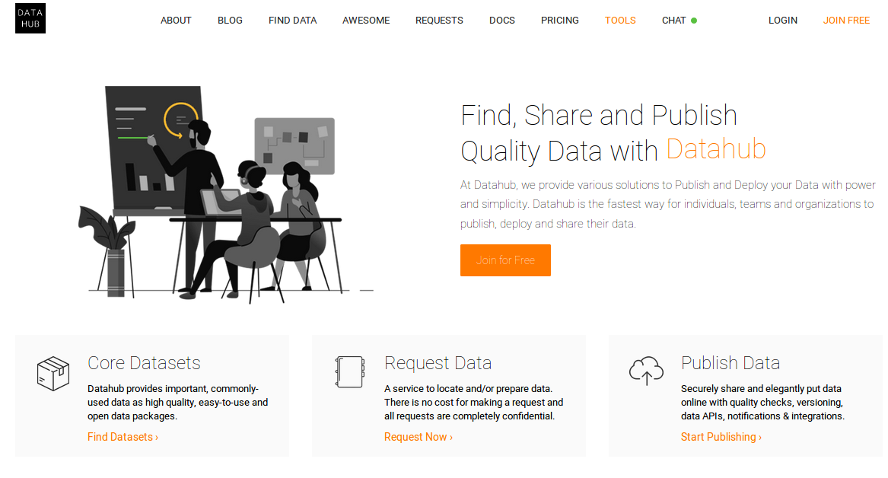

## Workshop Overview

* Part I: Conceptual Walkthrough
* Part II: ETL with OntoRefine
* Part III: SPARQL and GraphDB Visualization
* Part IV: Demonstrators

## Designing a SemTech PoC Live Training


# Typical Use Case

## Steps in Typical Use Case

What is a typical use case for a PoC?

. . . 

* Start with a question we want answered
* Have some messy data that partially answers the question

. . .

* Piece of the picture is missing but we can find it in LOD

. . .

* Create abstract model presenting the ideal data

. . .

* Transform messy sources from tabular to graphical form (ETL)

. . .

* Merge sources into a single dataset

. . .

* Further transformation to match data to our ideal data model

. . .

* Use finalized dataset to get answers 

# Our Use Case

## Our Use Case

### **Nepotism in Hollywood**

. . . 

**nepotism** /ˈnɛpətɪz(ə)m/

The practice among those with power or influence of favouring relatives or friends, especially by giving them jobs.


. . .

Mid 17th century: from French népotisme, from Italian nepotismo, from nipote ‘nephew’ (with reference to privileges bestowed on the ‘nephews’ of popes, who were in many cases their illegitimate sons).


## Simplified IMDB dataset

Our dataset is a simplified version of the public IMDB dataset


## Sources for Semantic Integration: LOD Cloud

* <a href=https://lod-cloud.net>https://lod-cloud.net</a>


## Sources for Semantic Integration: Datahub

* <a href=https://datahub.io>https://datahub.io</a>



## Sources for semantic Integration: DBPedia

* <a href=https://wiki.dbpedia.org>https://wiki.dbpedia.org</a>


# Analysis

## Analyse and document peculiarities of source data

. . . 

* number of records

. . .

* coverage of features (i.e. how many missing features)

. . .

* range of numeric features

. . .

* range of date features

. . .

* repetitive values in text features

# Auxiliary Resources

## Select existing auxiliary resources relevant to use case

. . .

* FOAF (Friend of a Friend)

. . .

* OWL

. . .

* Movie Ontology (not needed for this POC)

. . .

* Others to consider 

# Perform semantic conversion (ETL procedure)

## ETL Basics

## Normalise values

OntoRefine _text facets_ allow quick bulk-editing of values 


`United States` is normalised to `USA` in 122 cells 

## Create new columns 

Split columns according to a separator character 


## Urlify 

Edit the text in the cells


Remove whitespace so that the string can be used in a 
url/iri 

## Reconcile 

Use a reconciliation service to match strings to real world objects. 

`Bulgaria` > `https://www.wikidata.org/wiki/Q219`  

## Tabular to Linked Data

Moving from tabular data to linked data


## Tabular to Linked Data

Here is what our cleaned up table looks like...


## Tabular to Linked Data

... but here it is transformed into RDF.


# Data Integration

## Initial data model

Output from our ETL procedure


. . .

Does this model contain all the data we need?

## Expanding the initial model

Incorporating data from an additional data source.


. . .

Can we simplify things?

## Creating a new property

Single symmetric relation to use in a straightforward manner.


. . .

Can we simplify things further?

## Creating a second new property

Three relations transformed into a single one.


. . .

But we are still working with two disconnected parts.

## Connecting the dataset

Now we have everything we need to ask our question.


. . .

What if we want to ask a more complex question?

## Changing the model

At later stages we can rework the model which will then require corresponding changes to the procedure.


# Ontotext GraphDB Visualization 

## Google charts

Visualize data in google charts in GDB 


## Visual graph 

Highly configurable network visualisation using `SPARQL`


## Visualize family Relations 


## Visualize family Relations 2

{height=700px}

## Is there nepotism in Hollywood?

{height=700px}

# SPARQL Intro

## What is SPARQL?

* SQL-like query language for RDF data
* SPARQL 1.0 only allowed accessing the data (query)
* SPARQL 1.1 introduced:
   * Query extensions: Aggregates, Subqueries, Negation, …
   * Data management updates: Insert, Delete,  Delete/Insert
   * Graph management updates: Create, Load, Clear, Drop, Copy, Move, Add

## What is a SPARQL Query?

Main Idea: **Pattern matching**

* Queries describe sub-graphs of the queried graph
* Graph patterns are RDF graphs specified in Turtle syntax, which contain variables (prefixed by either “?” or “$”)
* Sub-graphs that match the graph patterns yield a result

## Query Types

There are four types of queries in SPARQL

* **ASK** – test whether a query patterns has a solution (yes/no) 
* **SELECT** – returns variables & their bindings
* **CONSTRUCT** – returns an RDF graph specified by a graph template
* **DESCRIBE** – returns an RDF graph containing (all) triples about one or more resources

## Query Type ASK

Test whether a query patterns has a solution

```sparql
ASK WHERE {?movie mdb:starring ?actor}
```

## Query Type SELECT

Returns variables & their bindings

```sparql
SELECT ?movie ?actor WHERE {?movie mdb:starring ?actor}
```

## Query Type CONSTRUCT

Returns an RDF graph specified by a graph template

```sparql
CONSTRUCT {?movie1 mdb:hasCommonActorWith ?movie2}
WHERE {
	?movie1 mdb:starring ?commonActor .
	?movie2 mdb:starring ?commonActor .
}
```

## Query Type DESCRIBE

Returns an RDF graph containing all triples about one or more resources

```sparql
DESCRIBE ?movie WHERE {?movie mdb:releaseDate “2011-05-06"}
```

## Components of a SPARQL Query

* List of namespace definitions
   * PREFIX
* Query form + variables
   * SELECT, CONSTRUCT, ASK, DESCRIBE
* List of data sources (optional)
   * FROM, FROM NAMED
* Query patterns and filters
   * WHERE: subqueries, expressions, BIND, VALUES, FILTER
* Solution modifiers
   * ORDER BY, LIMIT, OFFSET

## Components of a SPARQL Query Examples

```sparql
PREFIX mdb: <http://www.example.org/movieDB/>
PREFIX owl: <http://www.w3.org/2002/07/owl#>
PREFIX dbr: <http://www.dbpedia.org/resource/>
PREFIX foaf: <http://xmlns.com/foaf/>

SELECT ?movie ?actor
FROM <http://www.example.org/movieDB/>
WHERE {
    ?movie mdb:starring ?actor .
} 
ORDER BY ASC(?actor)
```

## Graph Patterns

* Basic graph patterns
   * A conjunction of triple patterns
* Optional graph pattern
   * Specifies optional parts of a pattern (similar to an “outer join” in SQL)
* Union graph patterns
   * Specifies disjunctions (alternatives)

## SPARQL 1.1 Query Extensions

* Aggregates
* Sub-queries
* Negation (NOT, NOT EXISTS)
* Expressions in the SELECT clause
* Property Paths
* Assignment (BIND)
* Enumeration (VALUES)
* A short form for CONSTRUCT
* An expanded set of functions and operators 


## Break 

Download materials: 

<http://presentations.ontotext.com/etl-files.zip>

Download and install GraphDB-free
 
<https://ontotext.com/free-graphdb-download/>

## Building a Semantic POC - Steps

1. Start with a question we want answered
1. Have some data that partially answers the question
1. Piece of the picture is missing but we can find it in LOD
1. Create abstract model presenting the ideal data
1. Transform sources from tabular to graphical form (ETL)
1. Merge sources into a single dataset
1. Further transformation to match data to our ideal data model

# Part II: ETL Process with OntoRefine

## Short Break

Load post-ETL repository:

<https://presentations.ontotext.com/movieDB_ETL.trig>

Download SPARQL queries for next section: 

<http://presentations.ontotext.com/queries.zip>

# Parth III: Transformation and Visualization with GraphDB

# Part IV: Demonstrators

## Web application  

## FactForge 

## Family relations with AgReLon

* Context
  * EHRI EC Project 
  * 5M Records of Holocaust survivors and victims (HSV)
    * Transcripts of lists of names  
* Data problem
  * Explicit family relations for 142K pairs (manually constructed by historians)
  * Many more in the data 
    * Families referenced by common number
    * People listed with their address 
    * Relationships between people present (in all european languages)  
  

## Input Data

* Flat [CSV](https://drive.google.com/drive/u/0/folders/0B5EhfCDyjEmCUWtQMTF6Y2pvV28) format 


## Mapping to AgRelOn


## Results 

* Much easier querying (agrelon:hasRelative)
* Inference of 10K links between previously unconnected nodes (10%)(only grandparents) 
* More possible (cousins)

## Questions 
