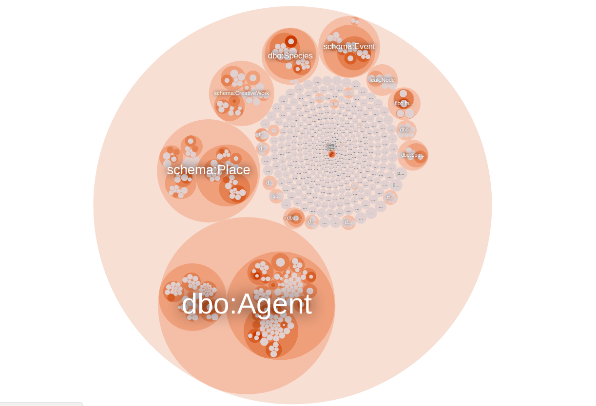
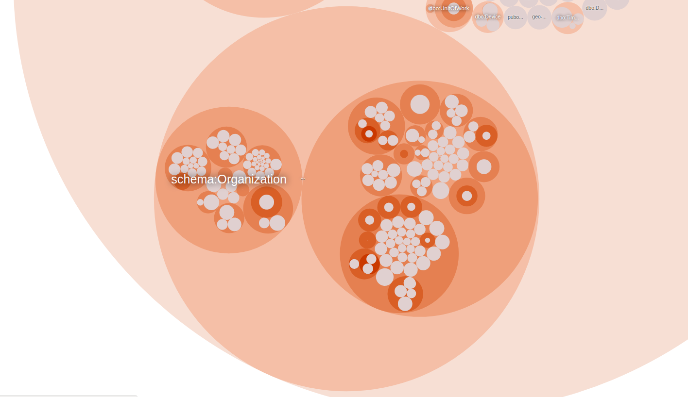
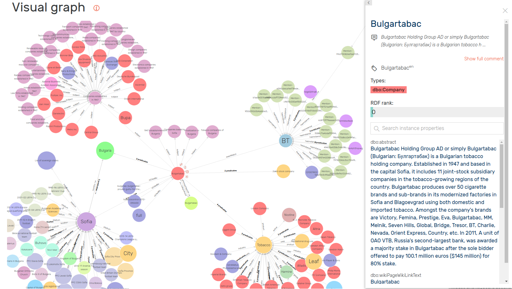

## FactForge: Data Integration

* **DBpedia** (the English version) 496M
* **Geonames** (all geographic features on Earth) 150M
* **owl:sameAs** links between DBpedia and Geonames 471K
* **Company registry data (GLEI)** 3M
* **Panama Papers DB (#LinkedLeaks)** 20M
* **Other datasets and ontologies**: WordNet, WorldFacts, FIBO
* **News metadata** (2000 articles/day enriched by NOW) 473M
* **Total size** (1611M explicit + 328M inferred statements) 1939М

## FactForge: News Metadata

* Metadata from Ontotext’s Dynamic Semantic Publishing platform
  * News stream from Google
  * Automatically generated as part of the NOW.ontotext.com semantic news showcase
* News stream from Google since Feb 2015, about 50k news/month
  * Over 1M news articles at present
  * ~70 tags (annotations) per news article
* Tags link text mentions of concepts to the knowledge graph
  * Technically these are URIs for entities (people, organizations, locations, etc.) and key phrases

## FactForge: Classes

## FactForge: Organisations

## Bottom-up Industry Classification

* Leverage wikipedia manual classification
* Normalize and organize
  * Merge and order to produce a hierarchy
  * 17361 industry tags with no clear connection
  * 9560 literals and 7801 IRIs
* The result
  * 32 top-level industries
  * 240 industries total organized in multiple levels
  * tag clusters give richness of expression

## The Problem

... as always- messy data.

* Companies are sometimes incorrectly classified (Type I error)
* Some companies are not classified in all appropriate industries (Type II error)

## The Task

Describe and evaluate a technique for identifying both types of errors in the data.

## The Data

## The Data II

* Simple csv dump
  * Contains all organisations
  * Includes several useful direct features
    * name
    * description
    * wikipedia categories
    * location
    * *industries*

## The Data III

* Deep graph features
  * No dump as there are too many possibilities
  * Provided are sample SPARQL queries to extract some promising features for each organisation
    * direct links to wikipedia articles
    * direct links from wikipedia articles
    * indirect links through news mentions
    * mapping from industries to lists of keywords
    * rich geographical information (through geonames)
    * parent/subsidiary relations
  * Mentors can provide assistance for modifying the queries or creating new ones for novel features

## The Data IV

<http://factforge.net/sparql>

