## Workshop Overview

| Start- End    | Topic                                                | Duration |
|---------------|------------------------------------------------------|----------|
| 13:00 - 13:15 | Introduction                                         | 15 min   |
| 13:15 - 14:00 | Session 1 - Model creation                           | 45 min   |
| 14:00 - 14:10 | *Break*                                              | 10 min   |
| 14:10 - 15:00 | Session 2 - ETL process                              | 50 min   |
| 15:00 - 15:30 | *Break*                                              | 30 min   |
| 15:30 - 16:30 | Session 3 - Data integration & visualization         | 60 min   |
| 16:30 - 16:40 | *Break*                                              | 10 min   |
| 16:40 - 17:30 | Session 4- Demonstrators (Alex)- Q&A                 | 50 min   |

## URL of this presentation

#### <https://presentations.ontotext.com/semtech-poc.html>

# Typical Use Case

## Steps in Typical Use Case

What is a typical use case for a PoC?

. . . 

* Start with a question we want answered
* Have some messy data that partially answers the question

. . .

* Piece of the picture is missing but we can find it in LOD

. . .

* Create abstract model presenting the ideal data

. . .

* Transform messy sources from tabular to graphical form (ETL)

. . .

* Merge sources into a single dataset

. . .

* Further transformation to match data to our ideal data model

. . .

* Use finalized dataset to get answers 

# Our Use Case

## Our Use Case

### **Nepotism in Hollywood**

. . . 

**nepotism** /ˈnɛpətɪz(ə)m/

The practice among those with power or influence of favouring relatives or friends, especially by giving them jobs.

. . .

Mid 17th century: from French népotisme, from Italian nepotismo, from nipote ‘nephew’ (with reference to privileges bestowed on the ‘nephews’ of popes, who were in many cases their illegitimate sons).

## Simplified IMDB dataset

* Our dataset is a simplified version of the public IMDB dataset
    * information on actors, directors and movies 
    * **no information** on family relations of actors

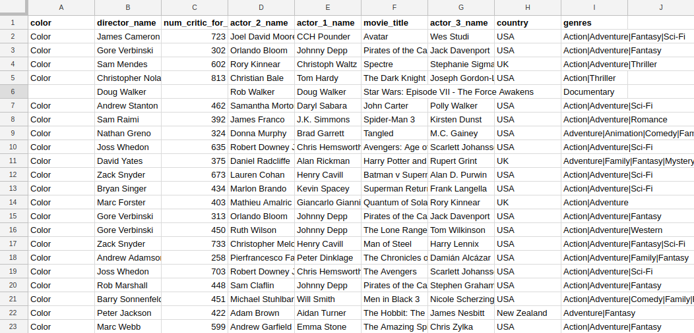

## Sources for Semantic Integration: LOD Cloud

* <a href=https://lod-cloud.net>https://lod-cloud.net</a>

## Sources for Semantic Integration: Datahub

* <a href=https://datahub.io>https://datahub.io</a>

## Sources for Semantic Integration: Google 

<https://toolbox.google.com/datasetsearch>

* Newest development
    * Not linked data but can easily be converted
    * Very rich
    * Growing very quickly

* <https://console.cloud.google.com/marketplace>
    * Large and dynamic datasets
    * Need to learn BigQuery and use (and pay for) Google Cloud

## Sources for semantic Integration: DBPedia

* <http://dbpedia.org/page/Harrison_Ford>

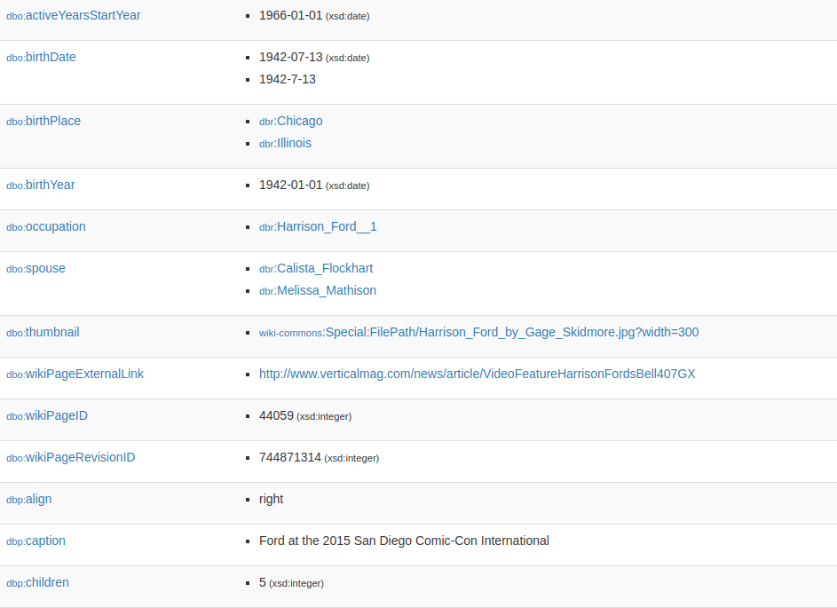

# Analysis

## Analyse and document peculiarities of source data

. . . 

* number of records

. . .

* coverage of features (i.e. how many missing features)

. . .

* range of numeric features

. . .

* range of date features

. . .

* repetitive values in text features

# Auxiliary Resources

## Select existing auxiliary resources relevant to use case

. . .

* [FOAF](http://xmlns.com/foaf/spec/) (Friend of a Friend ontology) 

. . .

* [RDFS](https://www.w3.org/2001/sw/wiki/RDFS) & [OWL](https://www.w3.org/OWL/) - Semantics for Classes, Properties and `sameAs` equivalence  

. . .

* [Movie Ontology](http://www.movieontology.org/), [schema.org](https://schema.org/),  (not needed for this POC)

# Perform semantic conversion (ETL procedure)

## ETL Basics

* **E**xtract 
* **T**ransform
* **L**oad

## Normalise values

OntoRefine _text facets_ allow quick bulk-editing of values 

`United States` is normalised to `USA` in 122 cells 

## Create new columns 

Split columns according to a separator character 

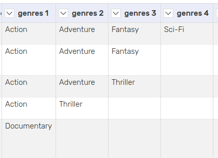

## Urlify 

Edit the text in the cells

Remove whitespace so that the string can be used in a 
url/iri 

## Reconcile 

Use a reconciliation service to match strings to real world objects. 

`Bulgaria` > `https://www.wikidata.org/wiki/Q219`  

## Tabular to Linked Data

Moving from tabular data to linked data

## Tabular to Linked Data

Here is what our cleaned up table looks like...

## Tabular to Linked Data

... but here it is transformed into RDF.

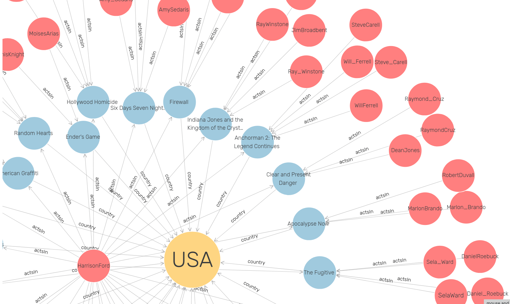

## Tabular to Linked Data

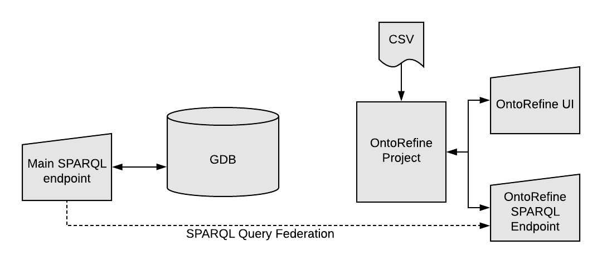

# Data Integration

## Initial data model

Output from our ETL procedure

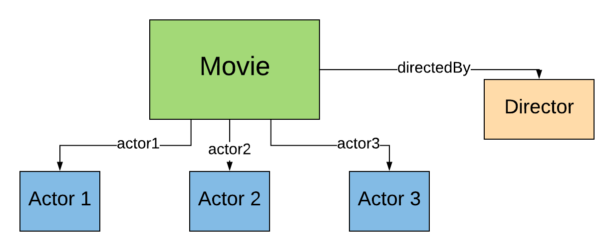

. . .

Does this model contain all the data we need?

## Expanding the initial model

Incorporating data from an additional data source.

. . .

Can we simplify things?

## Creating a new property

Single symmetric relation to use in a straightforward manner.

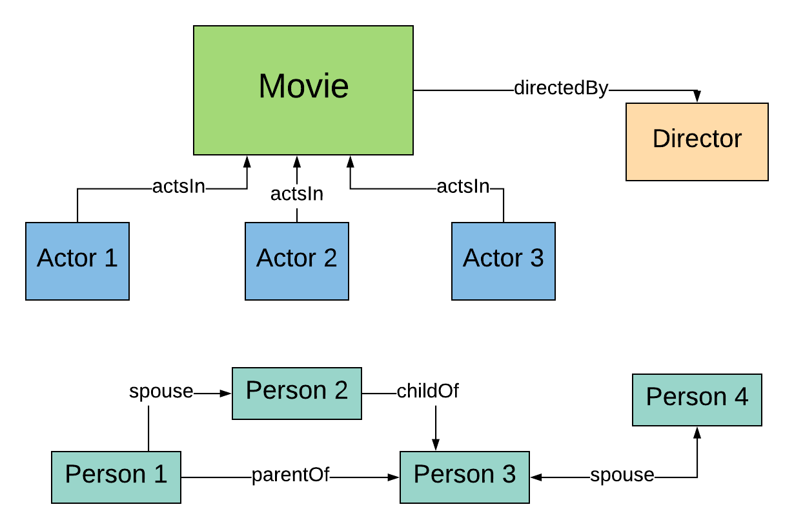

. . .

Can we simplify things further?

## Creating a second new property

Three relations transformed into a single one.

. . .

But we are still working with two disconnected parts.

## Connecting the dataset

Now we have everything we need to ask our question.

. . .

What if we want to ask a more complex question?

## Changing the model

At later stages we can rework the model which will then require corresponding changes to the procedure.

# Ontotext GraphDB Visualization 

## Google charts

Visualize data in google charts in GDB 

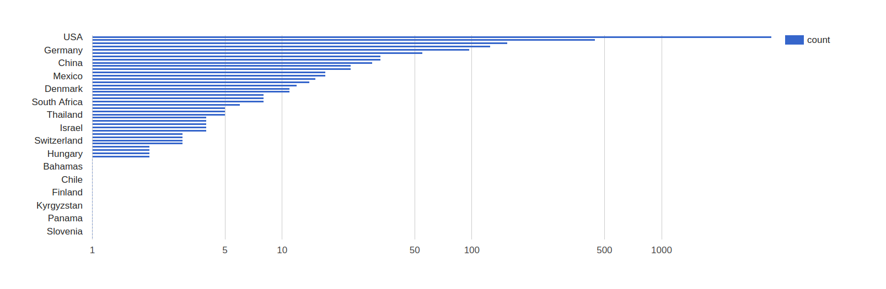

## Visual graph 

Highly configurable network visualisation using `SPARQL`

## Visualize family Relations 

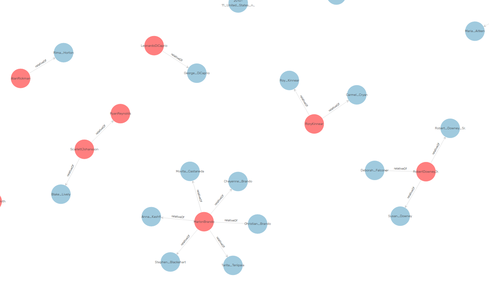

## Visualize family Relations 2

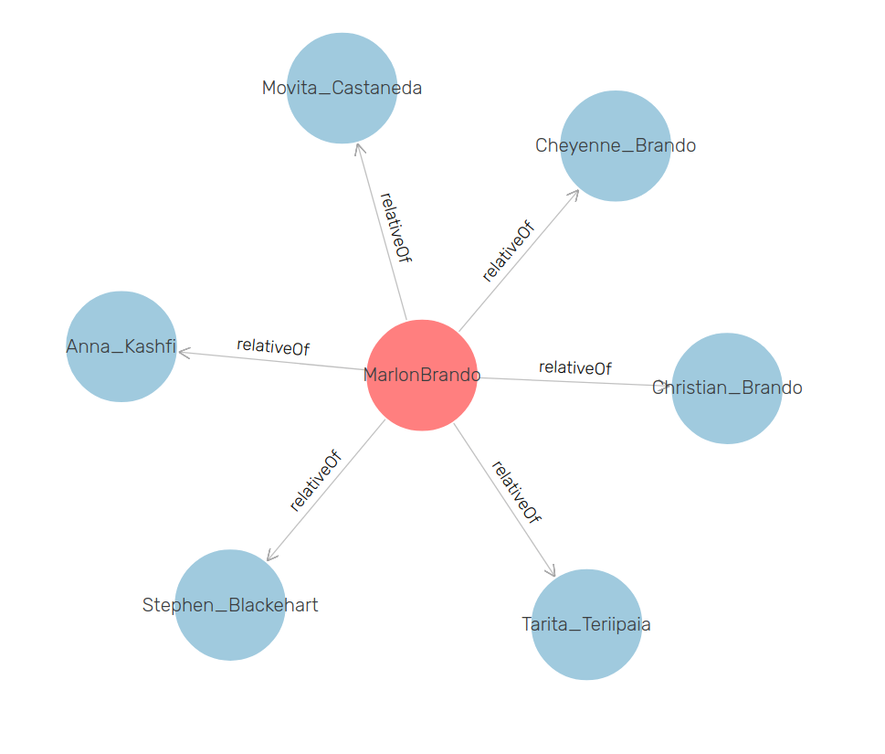{height=700px}

## Is there nepotism in Hollywood?

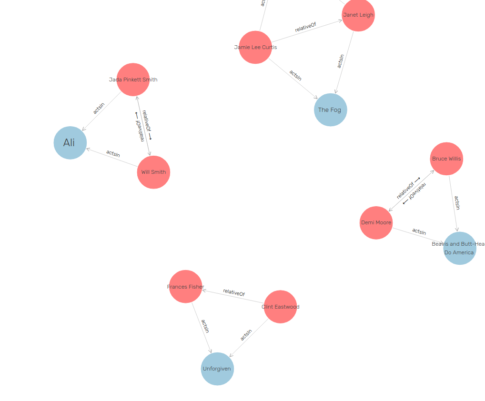{height=700px}

## Break 

* Download materials: 
   * <http://presentations.ontotext.com/etl-files.zip>
* Download and install GraphDB-free for your OS:
   * Windows: [GraphDB_Free-8.11.0.exe](http://download.ontotext.com/owlim/b6a8d634-b9e6-11e9-8719-42843b1b6b38/GraphDB_Free-8.11.0.exe)
   * Mac: [GraphDB_Free-8.11.0.dmg](http://download.ontotext.com/owlim/f32abe98-b9c7-11e9-bcff-42843b1b6b38/GraphDB_Free-8.11.0.dmg)
   * Linux [graphdb-free-8.11.0.deb](http://download.ontotext.com/owlim/d1ec4f08-b9e0-11e9-a29e-42843b1b6b38/graphdb-free-8.11.0.deb)

## Building a Semantic POC - Steps

1. Start with a question we want answered
1. Have some data that partially answers the question
1. Piece of the picture is missing but we can find it in LOD
1. Create abstract model presenting the ideal data
1. Transform sources from tabular to graphical form (ETL)
1. Merge sources into a single dataset
1. Further transformation to match data to our ideal data model

# Part II: ETL Process with OntoRefine

## Short Break

Load post-ETL repository:

<https://presentations.ontotext.com/movieDB_ETL.trig>

Download SPARQL queries for next section: 

<http://presentations.ontotext.com/queries.zip>

# Parth III: Transformation and Visualization with GraphDB

# Part IV: Demonstrators

## Web application  

## FactForge 

## Family relations with AgReLon

* Context
  * EHRI EC Project 
  * 5M Records of Holocaust survivors and victims (HSV)
    * Transcripts of lists of names  
* Data problem
  * Explicit family relations for 142K pairs (manually constructed by historians)
  * Many more in the data 
    * Families referenced by common number
    * People listed with their address 
    * Relationships between people present (in all european languages)  
  

## Input Data

* Flat [CSV](https://drive.google.com/drive/u/0/folders/0B5EhfCDyjEmCUWtQMTF6Y2pvV28) format 

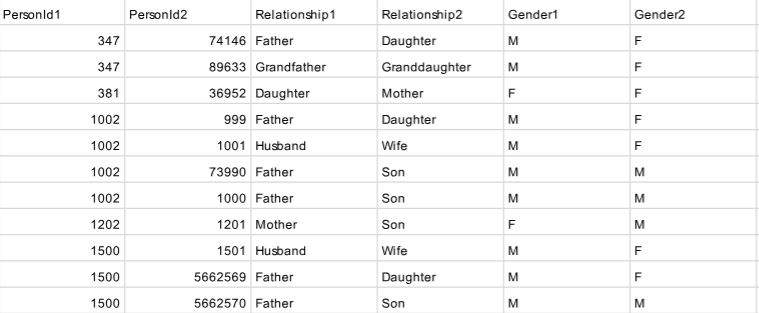

## Mapping to AgRelOn

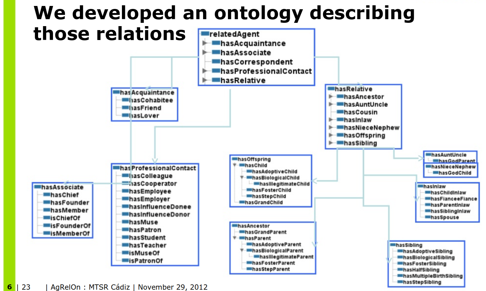

## Results 

* Much easier querying (agrelon:hasRelative)
* Inference of 10K links between previously unconnected nodes (10%)(only grandparents) 
* More possible (cousins)

## Questions 
