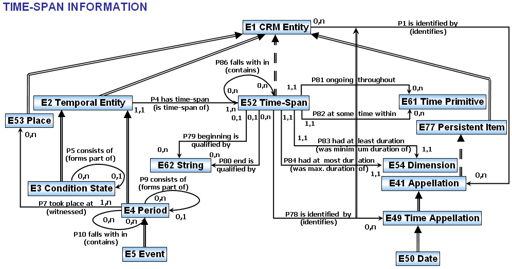
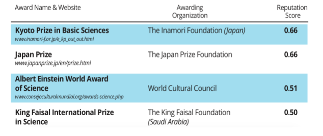
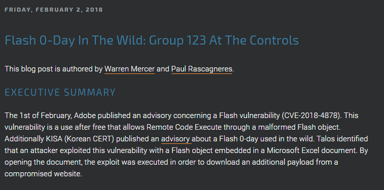

# About Ontotext  

## [About Ontotext](http://ontotext.com)

* Founded 2000, part of [Sirma Group](https://sirma.com/) (400 people, [BSE:SKK](http://www.bse-sofia.bg/?page=QuotesInfo&type=S&code=SKK&compnum=350), part of SOFIX), venture funding 2008
* 65 people: 7 PhD, 30 MS, 20 BS, 6 university lecturers. Offices in Sofia, Varna, London
* Core part of [Sirma Strategy 2022](https://2022.sirma.com/en/) with focus on cognitive computing
* Working on: semantic technologies, semantic repositories, semantic text analysis, machine learning
* Semantic Graph Database: [Ontotext GraphDB](http://graphdb.ontotext.com)
* Semantic data integration and building of Knowledge Graphs
* Semantic text analysis: entity, concept, relation extraction, document classification
* Recommendations, sentiment analysis
* Machine learning: entity disambiguation, deep learning in graphs, etc

## [Research Projects](https://ontotext.com/knowledge-hub/research-projects/)

## Current Projects:

* EHRI2: European Holocaust Research Infrastructure (H2020 RI)
* Evala: Congnitive and Semantic Links Analysis and Media Evaluation Platform (EuroStars)
* euBusinessGraph: Innovative Data Products and Services for Company Data (H2020 BigData Experimentation)
* COMPACT: From Research Through Policy on Social Media and Convergence (H2020 CSA)
* BigDataGrapes: BigData to Enable Global Disruption of the Grapevine-Powered Industries (H2020 BigData Research)
* CIMA: Company Intelligent Matching and Linking (BG OPC ISIS)
* TRR: Tracking of Research Results for EC framework programs (EC Tender)

## Research and Innovation Awards
Arguably, Ontotext is the most innovative Bulgarian software company.

* [Innovative Enterprise of the Year 2017](https://ontotext.com/company/news/innovative-enterprise-award-2017/)
* [EU Innovation Radar Prize 2016 nomination](https://ontotext.com/company/news/innovation-radar-prize-2016/)
* [BAIT Business Innovation Award 2014](https://ontotext.com/company/news/ontotext-receives-business-innovation-award-bait/)
* [Innovative Enterprise of the Year 2014](https://ontotext.com/company/news/ontotext-receives-innovative-enterprise-year-2014-award/)
* [Washington Post "Destination Innovation" Competition 2014 Award](https://ontotext.com/company/news/ontotext-lmis-openpolicy-wins-destination-innovation-competition/)
* [Pythagoras Award 2010](http://computerworld.bg/28883_ontotekst_poluchi_nagrada_pitagor) for most successful company in EU FP6 projects

We have more EU research projects than some universities combined

## Industries and Clients
80% of our sales are in the UK and US 

* Media: BBC, UK Press Association, NL Press Association (NDP)...
* Financial Info: S&P Global Platts, Euromoney, Financial Times, Nikkei...
* STEM Publishing: IET, Oxford University Press, Wiley, Elsevier, Springer Nature...
* Life Science: AstraZeneca, Novartis...
* Government: UK Parliament, The National Archives, Natural Resources Canada...
* Cultural Heritage and Digital Humanities

## About Me

* 2009 - MS in Linguistics at Toulouse Federal University 
* 2010-2015 PhD in Natural Language Processing at  Toulouse Federal University 
    * Processing of avaiation incident and accident reports. 
    * Data from Air France, DGAC and EASA 
* 2017 Semantic data consulting at Ontotext 

# EHRI - European Holocaust Reaserch Infrastructure 

## Context 

* The EHRI project
    * Core consortium of more than twenty organisations – research institutions, libraries, archives, museums and memorial sites. 
    * Mission is to support the wider Holocaust research community by building a digital infrastructure and facilitating human networks
 
* Person networks case   
  * 5Mi Records of Holocaust survivors and victims (HSV)
  * Producing and publishing a coherent dataset capable of supporting quantitative research approaches. 
  
## The Data problem

  * Transcripts of lists of names aggreted and managed by [USHMM](https://www.ushmm.org/)
    * over 40K sources (12K digitalized)
    * Total 5M records, one name per record + information depending on the source
  * The data is in the form of a **digital archive**
    * Excellent for finding information about individuals
    * Maximum of information from the various sources is conserved R
  * Impossible to exploit without a per record **human interpretative effort**
    * No record deduplication 
    * Ambiguous property names 
    * Important information raw in text fields 
    
## Example sources
 
* **243964**	Lodz-Names: A Record of the 240,000 Inhabitants of the Łódź Ghetto
* **3261**	Seznam osob popravených na základě rozsudku stanného, lidového a zvlastního soudu od 27.září 1941 a osob, jimž bylo zabaveno jmění podle těchto nařízení
* **3260**	Jewish Families Deported from Dorohoi to Transnistria
* **3256**	List of The Jews of Dés (Dej) Used in the Ghettoization of May 3-10, 1944
* **3180**	[Auschwitz to Buchenwald Transport, January 26, 1945]
* **1525**	[Data file of Jewish property owners in Panevezys, Lithuania from the Panevezys County Archive]
* **1522**	Franzstrasse   Nr. 38
* **740**	[Name data from a list of Jews who were released from Bergen-Belsen and arrived in Switzerland in December 1944]
* **501**	Survivor children airlifted from Theresienstadt "camp-ghetto" to England post-war

## Data integration task 
   * Record deduplication - identical/similar sounding names and close birth dates 
   * Reconstructing family relationships 
   * Linking people-clusters to events
    
## Linking and deduplication 

    
## Inferring Family relations 
  * Explicit family relations for 142K pairs (manually constructed by historians)
  * Many more in the data 
    * Families referenced by common number
    * People listed with their address 
    * Relationships between people present (in all european languages)  

## Peson networks model 

## AgRelOn Ontology 

## Results 

* From a source of 104K explicit relations inference of 10K more links between previously unconnected nodes (10% expansion) in the explict data
    * More possible (e.g cousins) if we extend AgRelOn even further
    
* Use of the AgRelOn abstraction hierarchy (_agrelon:hasRelative_ _agrelon:RelatedAgent_) and basis for bootstraping even more relations based on fragmented information from the original sources
    * Infer hasRelative based on available information (shared address, family number) 
    * Use "relationshipToHead" property to further refine the relationship type
    
* Total inferred relations  
    * 104M agrelon:relatedAgent 
    * 5.7M agrelon:HasRelative
    * 76K agrelon:hasOffspring
    * etc...
    
## Constructing of personal events 

(Work in progress)

* Construct personal events combining data from the source and data from the record. 
* Use CIDOC-CRM ontolgy (very complex)
* Perform location matching 
    * Geonames for known locations
    * Custom lists for historic locations (camps, ghettos etc)
    * Large number of completely unknown locations?
 * Connect people to temporal intervals and perform temporal reasoning to construct personal trajectories 

## CIDOC-CRM temporal entity model     

# TRR - Tracking of Research Results 

## Context and scope 

TRR Tracking of Research Results
EC want to better track impact of framework research programs

Pilot project - scope FR7-SP1 (8000) eu funded projects 

Ontotexts tasks:

* Semantic Data integration from various graphs of science
    * Publications
    * Researchers 
    * Organisations 
    * Patents 
    * Datasets 
* Data management and hosting
* Work on success indicators 
* *Build and host integrated knowledge graph*
* *NLP on project reports*
* *Web Scraping and crawling?* 

## Potential Datasources for a aggregated knowledge graph 

* OpenAIRE (Solid links to EC projects, quantity)
* CrossRef (issuers of DOI)
* OpenCitation (OCC and COCI)
* Scopus
* Web of Science
* Microsoft Academic Graph (solid data on affiliations)
* Semantic Scholar
* Arnet Miner
* Lens.org (Patents)
* ORCID: researchers, CVs (education and employment affiliations), publications
* Wikidata, WikiCite, Scholia
* Digital Science: Dimensions, UberResearch
* Wizdom.ai
* Springer Nature Science Graph
* DBLP
* (Aggregation) Open Academic Graph = MAG & Arnet Miner, by paper title, authors, year
* (Aggregation) DOIboost = MAG & CrossRef & Unpaywall, by paper DOI then author names

## Success indicators (1)

* Number of Nobel prize winners among FP7 researchers
* Number of winners of other prestigious international prizes (Fields Medal, Lasker Award, etc.)
* Number of winners of prestigious national scientific prizes
* Number of product, service, process innovations created
* Improved commercialisation/valorisation perspectives (number of projects/technologies attracting interest from industry, evidence of licensing, additional investment attracted, etc.)
* Number of dissemination events (conferences, workshops, etc.), of which key/major events involving policymakers
* Project websites (working/not working)
* Presence of social media profiles
* Data management plans
* Evidence of data shared
* Leveraged private and public investment in R&I (no. Of additional projects/grants; total funding received in euros)
* Additionally leveraged funding by SMEs/spin-offs/other organisations
* Number of researchers moving to another country/sector/discipline (for key researchers)

## Success indicators (2)

* Growth, jobs, industrial partnership, innovation clusters, access to new markets, commercialisation/potential for commercialisation, partnerships
* Effects of FP7 participation on economic performance (matched-pair approach)
* Number of new companies/spin-offs created
* Performance of newly created SMEs/spin-offs (size, turnover, profitability, etc.)
* Improved health and quality of life, working life, living environment
* Improved life expectancy
* Evidence of uptake of FP7 research in clinical guidelines/clinical trials involving humans (optional)
* Improved environmental performance, reduced greenhouse gas emission, reduced air pollution, improved water quality, better mitigated environmental risks, etc.
* Economic impacts, economic benefits, improved efficiency (in euros)
* Improved competitiveness relative to the US, Japan, China, other countries
* Social and cultural impacts (various, as per annex 13)
* Improved convergence between EU-15 and EU-13
* Influence on policy making/political impact

## Indicator 14 Scientific Awards 

Gathering awards from Wikidata

* Wikidata had concentrated structured data about 1224 "science awards" 
* Some awards did not have the appropriate Wikidata type (ex. “award” instead of “science awards”).
* Using the WP Category system we were able to add the correct type and extend the list to 1815 awards.

## Award winners in WikiData
Wikidata also has info on award winners (27443 “wins” of 983 awards)

## Extending wikidata award winners from Wikipedia categories 

* Award winners are often listed in Wikipedia using Wikipedia Categories 
* Categories are not the same accross languages 
* Wikidata has a property linking the award entiy to the wikipedia category 
* PetScan extracts lists of objects wikidata entitites from wikipedia categories 

Result:  2367 new award winners in Wikidata. 

## Petscan Interface

## Adding weight to awards 

* The IREG Observatory’s list contains the most prestigious awards ranked by reputation score
* The PDF file needs has been converted into a table
* The data has been matched to the list of awards from Wikidata
* The reputation score has been added to Wikidata

# Cyberthreat Report Screening 

## Context and scope 

(Open Source Intelligence) OSINT in the Banking sector
A lot of cybersecurity related data is publicly available 

* Dedicated data model (STIX)
* Data providors - MITRE corp (WIKI and STIX)
* MISP galaxy - Github repo with fresh data     
    

## Unstructured data 

* Cybersec reports in plain text 
* Security corporations (Symantec, Kaspersky), Blogs etc..  

## Cyberthreat report screenening 

* Goal1: Integrate public data sources in a client ontology and build a knowledge graph 
* Goal2: Automatically extract instance data from raw text and further populate the knowledge graph
    * Main difficulty: Entities manifest at different levels:
    * Local Named entities (apt28, group123, rokrat) - trivial to annotate automatically 
    * Complex entities such as techniques and tactics are more complicated 

`This vulnerability is a use after free that allows Remote Code Execute` 
T1203 Exploitation for Client Execution	

## Manual Annotation and textual classifcation task 

1. Manually annotate documents using Ontotext's annotation tool 

2. Build a textual classification pipeline that predicts if a sentence is a mention of a "Technique" or "Tactic" class. 

# Conclusions 

The Knowledge Graph is at the center of all projects and applications at Ontotext 
* EHRI - How available ontologies help organize the data an render it publishable    
* TRR - The importance of crowd-sourced data sources 
* CyberSec - An approach to convert unstructured textual data to a structured form in a commercial application  

# Public demos 

## Ontotext FactForge 

FactForge is a hub for open data and news about people, organizations and locations. Contains over 1B facts 
Showcasing GraphDB and Semantic Technologies 

<http://factforge.net/>

## GraphDB 

* Fast triplestore 100% W3C compliant 
* Free version with very few limitations 
* Excellent SPARQL editor
* Excellent ETL tools (OpenRefine integration)
* Fulltext search integration (Lucene, SOLR, Elastic)
* Very well documented 
* Many more features
* **Academic cooperation program**

<https://www.ontotext.com/products/graphdb/editions/>

