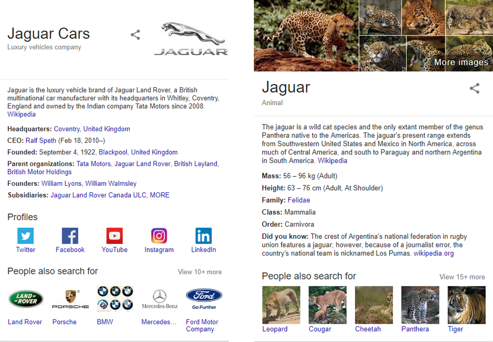
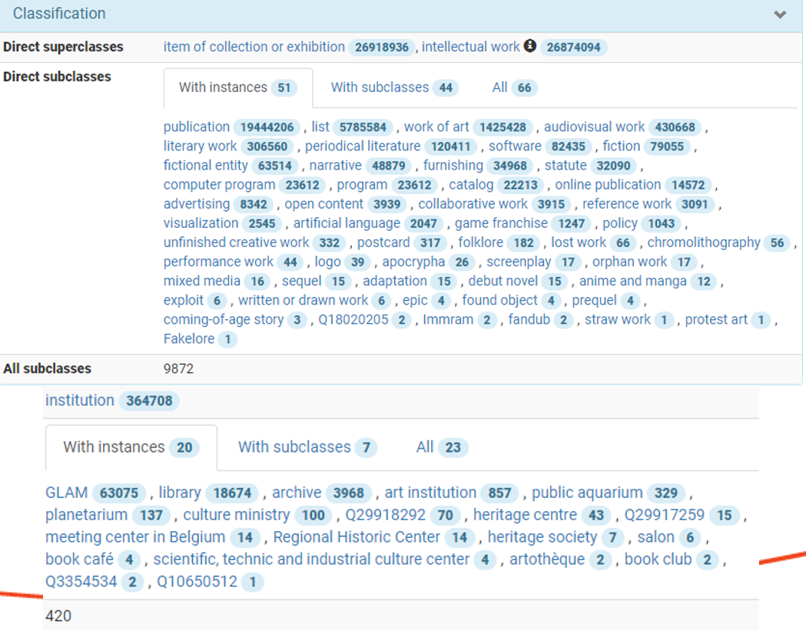

## Introduction 

* Semantic Data Integration is a lot more than Ontology Engineering:
   * Dataset research
   * Data analysis
   * Data cleaning
   * Semantic model: examples, shapes, documentation
   * Ontology engineering
   * Data mapping/conversion (ETL)
   * Instance matching/reconciliation
   * Data fusion/harmonization
   * Semantic text/metadata enrichment
   * Data enrichment, inference, aggregation
   * Sample queries
   * Semantic search, apps, visualizations

## How Does This Differ from Data Warehousing?

- Semantic databases (Knowledge Bases or Knowledge Graphs) are self-describing
- Data warehousing usually focuses on statistical data (OLAP)
- KGs can represent OLAP using the W3C Cube ontology, but can also represent any other kind of data
- There are vast LOD datasets that can be utilized in building KGs
- Everyone seems to be building a KG!

## Example 

Google KG: Entity Pages, Disambiguation

## Competence Questions

- Before developing applications, one better develop business requirements
- Before procuring/integrating data, one better develop competence questions
- These are sample questions that the KG should be able to answer
- They should lead both dataset research and semantic modeling

# Dataset Research

- Given a data goal (competence questions), what datasets are available and relevant?
- What is the enterprise data that we "intuitively" know should be captured?
- Are there data gaps compared to the competence questions? How can we fill them?

## How to Find Datasets?

- Wikidata's [`external-id` props](https://www.wikidata.org/wiki/Special:ListProperties/external-id) are an excellent source (over 3700)
- A lot of them have corresponding [Mix-n-Match](https://tools.wmflabs.org/mix-n-match/#/) catalog
  - A lot are potentially applicable to GLAM, eg Authority control for people 510, Identifier 196, Authority control 102, Authority control for artists 59, Cultural heritage identification 34, etc
- Wikipedia categories and Related links
- https://datahub.io and https://old.datahub.io
- http://lod-cloud.net

 

## LOD Cloud

The [Linked Open Data (LOD) Cloud](https://lod-cloud.net/#diagram) contained 28 datasets in 2007

{height=500px}

## ... 89 datasets in 2009 ...

{height=500px}

## ... 295 datasets in 2011 ...

{height=500px}

## ... 570 datasets in 2014 ...

{height=500px}

## 	... 1234 datasets today!

{height=500px}

16136 links between datasets, 30B triples

## Wikidata

Number of Creative Works and Cultural Institutions in Wikidata:

## Finding Data

* By Example:
   * Eg to find computer science awards, get a famous computer scientist (eg Tim Berners-Lee) and explore his awards
   * Eg to find artist biographic info, get a well-known artist (eg Emily Carr), find mentions of her on the web, list the ones that provide good biographic text
* Knowledge and experience helps
   * Keep abreast of LOD developments in your domain
   * Read papers, especially in the SWJ <http://www.semantic-web-journal.net/accepted-datasets>

# Dataset Analysis 

## Scope

* Feasibility estimations confronting the data with the use cases.
* Familiarisation with the data 
    * Size and complexity estimations of the data are performed
    * The data is comprehensively understood
    * Exceptional values are extracted and analyzed 
* Cardinalities are extracted and analyzed 
* The tools for the later phases are chosen
* General feasibility is estimated 
* The groundwork for the mapping component of ETL is laid down

## Key Value Analysis

* Key values that often drive the mapping. Key-values could be mapped to:
    * Individual (eg `skos:Concept`)
    * Class
    * Property
    * or can even dictate a mapping decision, eg one mapping branch for Persons, another for Organizations 

## Key Value Example 

Frоm Getty LOD - ["Excel-driven Ontology Generation™"](http://rawgit2.com/VladimirAlexiev/my/master/pres/20140905-CIDOC-GVP/index.html#slide-org8a0275d)

[ref](http://rawgit2.com/VladimirAlexiev/my/master/pres/20140905-CIDOC-GVP/index.html#slide-org8a0275d)

## Data Coverage

Example: PubMed Field Statistics

## Data Quality

- Coverage assessment dictates what is worth converting
- Quality assessment drives data cleaning needs and decisions

# Data Modeling

## Scope 

- Create a data model for the domain of interest
- Find existing relevant ontologies to use
- Add custom classes and properties as needed (Ontology Engineering)
- Document the model comprehensively: describe modeling patterns, justify decisions
- Document in machine-readable way using RDF Shapes (SHACL or ShEx) 
- Make examples that can drive (generate) other artifacts, eg example diagrams, shapes

## URL Design 

* "URL Design" is something simple yet fundamental to RDF and LOD.
* It's a fundamental part of TimBL's [5-Star Linked Data](https://www.w3.org/DesignIssues/LinkedData.html) principles: 
  [CoolUri's don't change](https://www.w3.org/Provider/Style/URI.html),
  [Cool URIs for the Semantic Web](https://www.w3.org/TR/cooluris)
* Well-designed URLs enable highly distributed ETL development and execution
* Experience shows that leaving URL design to ETL devs is not a good idea: unspecified URLs cause disconnected data
* [Platts URL Design](https://docs.google.com/document/d/158vjEJM34rSmQLnrUlV4GzxyKytBJImQLGe_-QUrkQA/edit#) (internal document, could be shared)
* [Getty doc on URLs](http://vocab.getty.edu/doc/#GVP_URLs_and_Prefixes)

## Existing or New Ontology?

Pros:

- Reuse as much as possible
- This will save you time, and will make your data more easily reusable
- Search for ontologies: [Linked Open Vocabularies](https://lov.okfn.org)

Cons:

- Multiple namespaces make data production/consumption a bit harder
- Schema.org is the ultimate "chauvinistic" example: single namespace, and even extensions (eg GoodRelations or SchemaBibEx) land in the same namespace.
  - I guess webmasters like the simplicity (and still often get it wrong ;-)
- Don't reuse a complex ontology for a single term (heavy ontology baggage)
- Consider reusing ontology terms, but not necessarily loading the ontology
  - Example: every `dct:` property is a subprop of `dc:`, and such inference may be useless to you

## Ontology Methodologies

How to do ontology engineering?

- Avoid it if you can (i.e. reuse ;-)
- Competence Questions !
- Methods such as DILIGENT, METHONTOLOGY, NeON Methodology, ROO Kanga, SAMOD (Simplified Agile Methodology), HCOME (Human-centered ontology method), Aspect OntoMaven (Aspect-Oriented Ontology Development), IDEF5, ONTOCOM (cost estimation)
- [Ontology Design Patterns](http://ontologydesignpatterns.org): typical situations. Composable!
- Top-level ontologies: BFO, CCO, DOL/DOLCE, SUMO, UFO, Proton...
  - For cultural heritage: CIDOC CRM, ConML/CHARM

# Data Conversion (ETL)

## Scope

* Transformation and homogenization of data sources into the target format, in order to populate the semantic model with instances
* Important elements:
   * Choice of tools in accordance with the need and requirements 
   * Maintainability of the solution 
   * Reproducibility / exportability  / portability 
   * Data cleaning 
* Other Considerations:
   * formats
   * size scale (tools parse in memory)
   * consistency with existing conventions (project, sector) 

## Example

Onto [ETL tools evaluation](https://confluence.ontotext.com/display/DOM/ETL+Tools+evaluation)

# Validation

## RDF Shapes

TODO links

- ShEx: W3C community spec. Pros: much briefer (compact, JSON and RDF representations), allows recursive data models, flexible focus nodes (shape map).
- SHACL: W3C standard. SHACL-core and SHACL-standard. Advanced Features is a community spec. Pro: standardizes validation results
- [Validating RDF book](http://book.validatingrdf.com/) (reviewed by Ontotext)
- Implementations [at Validating RDF wiki](https://github.com/validatingrdf/validatingrdf.github.io/wiki/Updated-list-of-implementations)): summarized at next slides, but see the link for more details!

## ShEx Implementations

| name              | language | playground, source, distribution                                                                                             |
|-------------------+----------+------------------------------------------------------------------------------------------------------------------------------|
| shex.js           | js       | http://rawgit.com/shexSpec/shex.js/master/doc/shex-simple.html, https://github.com/shexSpec/shex.js/                         |
| ShEx NPM          | js       | https://www.npmjs.com/package/shex                                                                                           |
| ShEx-validator    | js       | https://github.com/HW-SWeL/ShEx-validator                                                                                    |
| Validata          | js       | http://hw-swel.github.io/Validata/, https://www.w3.org/2015/03/ShExValidata/, https://github.com/HW-SWeL/Validata            |
| ShExJava          | java     | http://shexjava.lille.inria.fr/, https://github.com/iovka/shex-java, https://gforge.inria.fr/projects/shex-impl/             |
| RDFShape, ShaclEx | scala    | http://rdfshape.weso.es/, http://shaclex.herokuapp.com/, https://github.com/labra/rdfshape, https://github.com/labra/shaclex |
| TrucHLe           | scala    | https://github.com/TrucHLe/SHACL                                                                                             |
| PyShEx            | python   | https://github.com/hsolbrig/PyShEx                                                                                           |
| shex.rb           | ruby     | https://github.com/ruby-rdf/shex                                                                                             |
| ShExkell          | haskell  | https://github.com/weso/shexkell                                                                                             |

## SHACL Implementations

| name              | language | playground, source,distribution                                                                                                                          |
|-------------------+----------+----------------------------------------------------------------------------------------------------------------------------------------------------------|
| SHACL API         | java     | https://github.com/TopQuadrant/shacl                                                                                                                     |
| SHACL rdf4        | java     | https://github.com/eclipse/rdf4j-storage                                                                                                                 |
| SHACL batch       | java     | https://github.com/PaulZH/shacl-batch-validator                                                                                                          |
| ELI-validator     | java     | http://publications.europa.eu/eli-validator/home, http://labs.sparna.fr/eli-validator/,                                                                  |
| OSLO Validator    | java     | https://data.vlaanderen.be/shacl-validator/, https://github.com/pwc-technology-be/OSLO2Validator, https://github.com/Informatievlaanderen/OSLO-Validator |
| shacl-runner      | scala    | https://github.com/balhoff/shacl-runner                                                                                                                  |
| STTL SHACL        | java     | http://corese.inria.fr/, http://ns.inria.fr/sparql-template                                                                                              |
| Netage SHACL      | java     |                                                                                                                                                          |
| SHACL JS          | js       | http://shacl.org/playground/, https://github.com/TopQuadrant/shacl-js                                                                                    |
| SHACL-Check       | js       | https://github.com/linkeddata/shacl-check                                                                                                                |
| RDFShape, ShaclEx | scala    | http://rdfshape.weso.es/, http://shaclex.herokuapp.com/, https://github.com/labra/rdfshape, https://github.com/labra/shaclex                             |
| pySHACL           | python   | https://github.com/CSIRO-enviro-informatics/pyshacl-webservice, https://github.com/RDFLib/pySHACL                                                        |
| RDFUnit           | java     | https://github.com/AKSW/RDFUnit/                                                                                                                         |
| alt SHACL         | python   | https://github.com/pfps/shacl                                                                                                                            |

## Custom Test Suites

- [RDFUnit](http://rdfunit.aksw.org/) ([source](https://github.com/AKSW/RDFUnit), [demo](https://github.com/AKSW/RDFUnit)): sources custom patterns, OWL, OCLS shapes, DC Application Profiles, SHACL
- Only SPARQL queries
  - negative examples 
- SPARQL queries and example output 
  - Compares output of a query to the desired output
  - Could test data and/or the queries themselves
- Domain Specific-Validation
  - Eg for SKOS: [qSKOS](https://github.com/cmader/qSKOS), [Sparna SKOS Tester](http://labs.sparna.fr/skos-testing-tool/)

# Text and data enrichment

## Scope 

Semantic enrichment is the adding of value to a dataset by increasing the amount of queryable information it contains and/or decreasing the data's noisiness. This is done in several ways:

* Inference and link discovery 
* Thesaurus harmonisation
* Entity mining
* Instance matching and deduplication.
* Data fusion 

## Inference and link discovery 
* Inference : Attributes and relations are added based on rules. 
* Link discovery. The structure and redundancies of the graph are exploited in order to discover new relations between entities (graph based ML)
    * Subgraph similiarity to infer new links 
    * e.g Facebook friend recommendations 
    * e.g Amazon product recommendations 
   
## Thesaurus harmonisation

## Entity mining. 
* Unstructured data (text, images) is processed in order to extract novel entities and relations and add them to the dataset.
* Content classification 
    * Attribution of categories to text, images or sound clips  
    * Statistical methods 
    * e.g e-mail filters
* NLP Named entity recognition (NER)
    * Ontotext [NOW](https://now.ontotext.com/#channel?uri=http%3A%2F%2Fwww.ontotext.com%2Fpublishing%23International&type=channel) and [TAG](https://tag.ontotext.com/), 
    * [Google NLP](https://cloud.google.com/natural-language/), etc 
* Relation extraction from text 
    * NER + relations between entities 

## Data fusion. 
*Redundant data is deduplicated and fused to produce a single master dataset without conflicts. 
    * selection of representative single fields (eg logo), 
    * accumulation of multiple fields (eg names, transactions), 
    * aggregation of summary fields (eg count or total amount)

## Matching

* Critical problem in data cleaning and integration
*  Overlapping instances across multiple datasets (client only or client and LOD)  are matched and the sum of their attributes across datasets become available for querying. 
* Entity matching (EM) finds data instances that refer to the same real-world entity
* We focus on EM as a process of transforming a string to a thing based on the provided semantic context

## Basic Reconciliation

* Fuzzy name matching 
* Simple additional features (e.g. exact string matches, differences in numbers)
* Out-of-the-box match scoring & available recon services  
    * Openrefine, Ontorefine 
    * [wikidata recon service](https://www.wikidata.org/wiki/Wikidata:Tools/OpenRefine#Wikidata_reconciliation)
    * [reconcile-csv](http://okfnlabs.org/reconcile-csv/) - build-your-own  
## Advanced Reconciliation

* Custom field parsing and normalization - additional parsing rules (acronyms, titles, dates etc) 
* Complex additional features 
    * text analysis
    * hierarchical features
    * geographical features 
    * network topology
* Custom match scoring (possibly deep learning) 
    e.g [deep siamese text similarity](https://github.com/dhwajraj/deep-siamese-text-similarity)    
  
# Modelling update flows
  
# Model documentation

## Scope

* Data Diagrams
* Detailed description of both new ontology terms (classes and properties) and reused ones (describing the specific use in our application profile). 
* Reference documentation 
    * Generated by an [ontology documentation tool](https://confluence.ontotext.com/display/DOM/Ontology+Documentation+Generators)  
    * Hand written comprehensive doc
* Semantic publishing of model    
* Sample Queries 
                  
## Sample queries

* Very handy way to augment the documentation 
    * Can be used by a new user to get a feel of the data
    * Highly informative when combined with a short description 
    * Stem out of competence questions
    * Can be used for testing purposes 
* Eg [GVP sample queries](http://vocab.getty.edu/queries)
  
# Semantic search apps and visualizations 

## Semantic Search 

* Search for concepts rather than strings 
TODO nice example 

## Visualizations

* [GDB Visual Graph](https://trr.ontotext.com/graphs-visualizations?saved=f1e48609dbea4e79be96c0bdcba24617)
* Wikidata Viz [page](https://www.wikidata.org/wiki/Wikidata:Tools/Visualize_data)
* Neo4j Graph Database Platform [Graph V-Day recap](https://neo4j.com/blog/graph-visualization-day-recap/)
  
